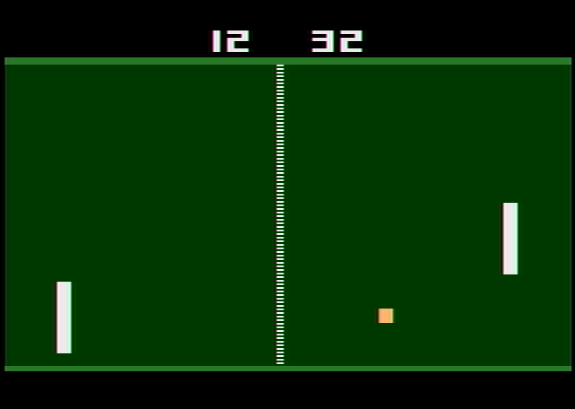
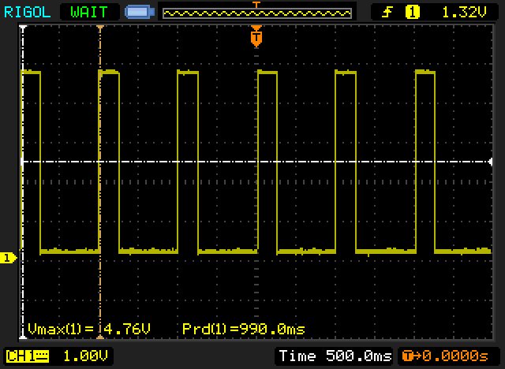

# A 1hz signal generator, implemented on an Atari 2600

I went through a brief face when I tried "Racing the Beam", 
which is basically learning how to program the Atari 2600.
This machine first came out in 1977, and had a 6507, the
poorer sibling of the common 6502 from that era.  The Atari
2600 (also known as the Video Computing System, or VCS) had
just 128 bytes of RAM, and the baseline cartridges just 2K
of ROM.  It also had essentially no framebuffer: the background
playfield was just a 40 bit shift register, and it had a
two player registers which were clocked out by a custom chip 
called the TIA (the Television Interface Adapter).  

On such a machine, Pong is pretty simple, but doing things
that are more sophisticated can be quite difficult.   It is 
amazing how skilled programmers created games which would
have been unimaginable by the machine creators.

Back to the 1Hz challenge...

Around 2006, the Dutch design firm Buro Vormkrijgers
created a clock that told the time by playing a game of Pong.
The paddles would move up and down and when minutes and 
hours were incremented, the appropriate side would "lose",
so that the score recorded the time.   In 2010, I was 
interested in maybe doing another project using the 
Atari 2600, so I decided that I would go ahead and implement
my own version of the Pong Clock using the Atari 2600 as
base hardware.   

Fast forwarding to 2025, I heard about the Hackaday 
1Hz challenge, and thought that it might be fun to dust off
this code, and repackage it with a few bug fixes.  The ball
should hit the paddle at a precise 1Hz interval, except when
the minutes or hours are incremented.  It is designed for 
use on the NTSC versions, counting the 60 frames per second,
and automatically find tunes the speed of the ball to maintain
a 60hz update rate.

What isn't perhaps widely known is that the Atari 2600 can not
only read data from the joystick ports, but it can configure 
them as outputs as well.  Some minor tweaks to the code and 
the Atari 2600 can act as a primitive signal generator.  I configured
it to output a square wave with 1 Hertz period with the up time 
of 250ms.  I dug out a female DB9 and wired hooked up my 
Rigol DS1102E scope up to it to measure the voltage.  And... voila!

